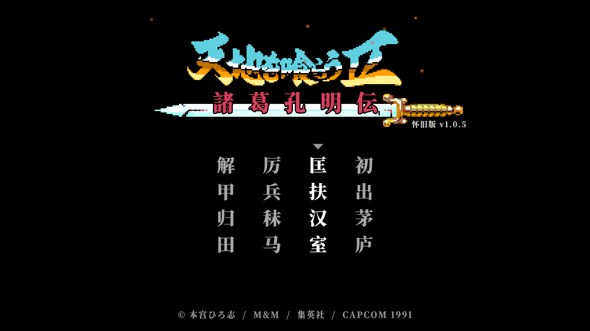
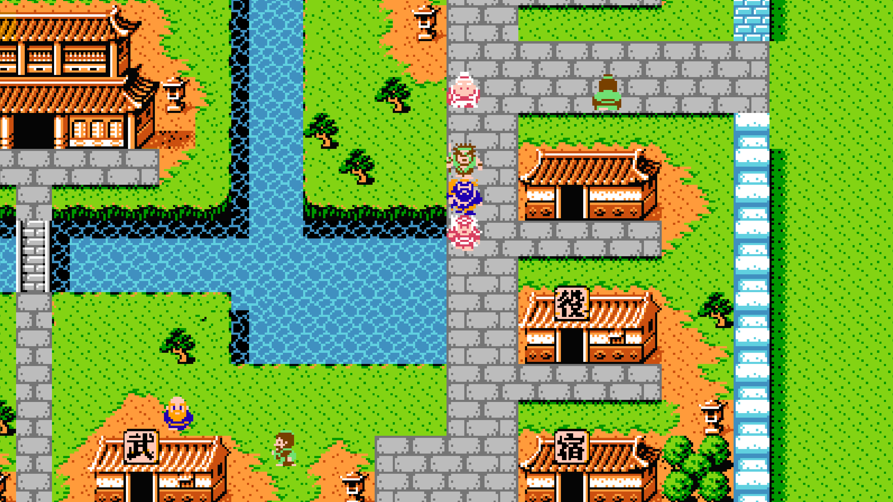
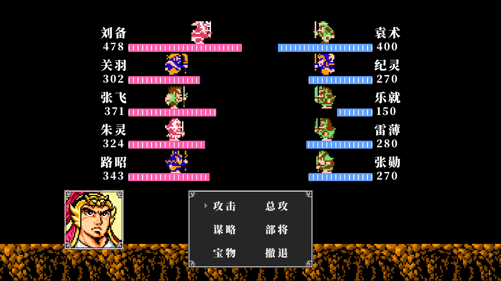

# 吞食天地2诸葛孔明传怀旧版

### 简介
剧情和数据都是基于原版的，当然有几个数据会稍微有出入。  
游戏中武将离队装备会自动脱卸，入队会自动装备，但是注意饰品不会装备  
周瑜和吕布会主线后自动加入队伍，主要为了降低中期的难度，因为第一把换代的武器就是剑  
现在军师可以前五出战。周瑜会免击和八卦，缺暗杀和免策。姜维会暗杀和八卦，缺免策和免击。诸葛会免策和八卦，缺暗杀和免击，这样大家可以灵活选择军师  
游戏的默认按键是WASDJK，PC支持改键，手机支持按键位置移动  
关于分辨率的话，手机可能会出现两条黑边的，因为没有精力去适配各种比例让UI都能体现的很完美。PC支持16:9，16:10  
游戏默认不支持电脑手柄  

游戏中难免有各种bug，个人技术、设备有限，只能请各位见谅了

### 注意：
更新版本时，Android版直接下载新版本，安装覆盖，千万不要卸载原文件，防止存档丢失，其他版本只需下载解压打开即可。
若手机版出现按键失灵现象，大家可以尝试息屏后再打开试一下
如果游戏过程中出现各种卡死问题，请通过读档来进行尝试

### v1.0.5
- 修复战斗攻击公式中受击方阵型数据获取错误的问题
- 修复战斗结束后切换场景后仍会播放战斗结束的音效的问题，获得重要道具或者人员加入时音效混杂的问题
- 修复雒城和天水城中无法进入役的问题
- 修复曹操英灵之地血条不会随着等级变化的问题
- 修复蒋家村地图音乐错误的问题
- 按键绑定时支持ESC重置按键功能
- Android版按键优化，降低按键失灵的概率

### V1.0.4
- 第八章添加英杰之地，地点位于长安城东北小岛上，打完最终Boss司马懿才会出现前往该地的船只。
      - 英杰之地可购买最终装备和道具
      - 英杰之地随机战中敌人的HP的会随着当前的队伍历练等级而提升
      - 英杰之地随机战城防值在0.2-1.0中随机产生，BGM会根据敌人的城防而发生
          变化规律是，[0.2-0.3]是Boss，(0.3-0.5]是攻城战，(0.5-0.8]是野外将领战， (0.8, 1.0]是普通战
- 剧情中武将离队前回复所有状态，防止队伍只剩离队人员时离队后程序错误的问题
- 修复庞义村、蒋琬母被困小屋地图边间问题
- 修复第五章吕布零陵寨中战斗背景图出错的问题；修复第八章司马懿洛阳战胜利后司马懿对话头像未出现的问题
- 修复葭萌关第八章出入口错误的问题
- 修复庞义居庞义对话出去后，庞义占据楼梯无法拿到青铜钥匙的问题

### V1.0.3
- Android版按键优化，降低按键失灵的概率
- 修复柴桑水路中坐船过程中，读档错误的问题
- 修复部分洞窟场景中使用缩地计后错误的问题
- 修复使用野营帐后状态页面没有及时刷新的问题
- 修复吕布与曹仁战过程中曹仁方能偷袭的问题
- 修复敌方李严武器为弓，却只攻击一次的问题

### V1.0.2
- Android版方向键优化，修复抽风现象
- Android版添加UI宽高适配
- 修复使用野营帐造成的卡死问题
- 修复涪水寨外大地图上方的水可以行走的问题
- 修复长安城中隐藏道具薄刃斧位置出错的问题
- 优化场景

### V1.0.1
- 第二章宛城关羽居过五关斩六将前增加一把石刀，防止卖掉后没有装备可用
- 修复主线第四章庞统过早出现导致流程出错
- 战斗滚动字幕速度优化
- Android版按键添加放大缩小设置
- 修复最终章汜水关司马师战败后语音文本乱行的问题
- 修复赤壁之战战败后再读档出错的问题